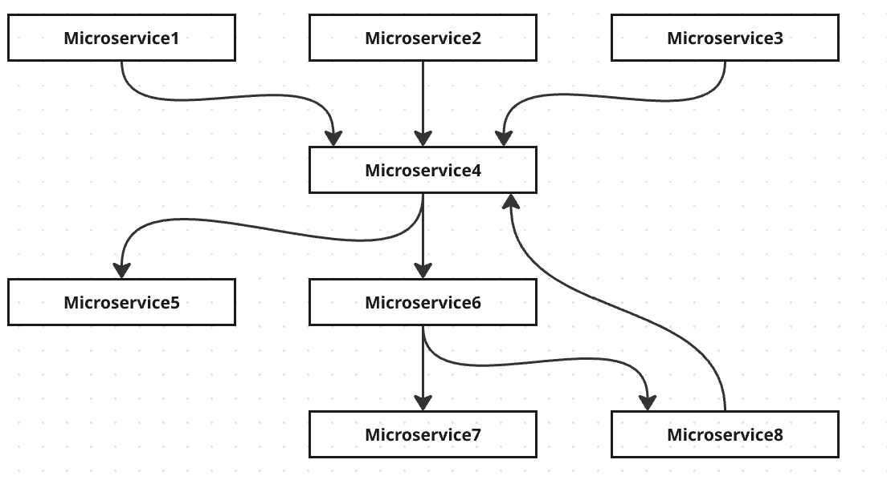

## What problem does Apache Camel solve?

### Enterprise Integrations are Complex

- Enterprises have hundreds or even thousands of applications:
    - These applications have complex communication patterns.
    - They use a variety of transports (HTTP, Queues, etc.).
    - They use a variety of protocols (HTTP, JMS, AMQP).
- The evolution of Cloud and microservices makes enterprise integrations even more complex.
- **How can we simplify enterprise integration?**
    - How do we simplify the code we write to allow a microservice to communicate with other microservices?
    - How do we ensure it follows all best practices?

### The Solution: Enterprise Integration Patterns

You could follow Enterprise Integration Patterns. However, understanding these patterns and implementing them correctly is a significant challenge.

- **How to implement Enterprise Integration Patterns?**
    - Use **Apache Camel**.

 

## What is Apache Camel?

Apache Camel is an open-source framework that facilitates the integration of versatile systems that consume or produce data. It is inspired by a book titled **Enterprise Integration Patterns** by **Gregor Hohpe and Bobby Woolf**, a remarkable book that presents all enterprise integration patterns.

Over the last decade, we have evolved towards microservices architectures, and many companies today use the cloud to deploy their applications. In addition to the patterns found in the "Enterprise Integration Patterns" book, Apache Camel also helps us implement patterns around microservices, architectures, and the cloud.

 

## Advantages of Apache Camel

One of the important aspects of Apache Camel is that it is very lightweight and extensible. It helps you integrate with a large number of other applications. You can integrate **Kafka, ActiveMQ, JMS, HTTP, Netty, or AWS S3**.

The reason is that Apache Camel uses what is called a **component architecture**. There are hundreds of different components for databases, message queues, APIs, and Cloud integrations.

Apache Camel also supports over **200 protocols**, transports, and data formats, and over **300 converters** between these data formats. Apache Camel also provides a Domain Specific Language (DSL), which is tailored to application integration needs.

In a constantly evolving software development environment, companies must integrate varied applications and systems that often use different languages. Apache Camel serves as a bridge between these diverse systems, facilitating smooth data exchange.

 

*In the next post, we will look at the architecture of Apache Camel.*
