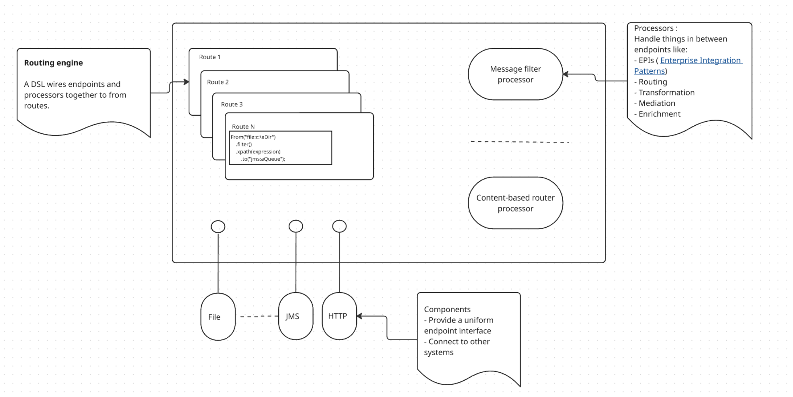
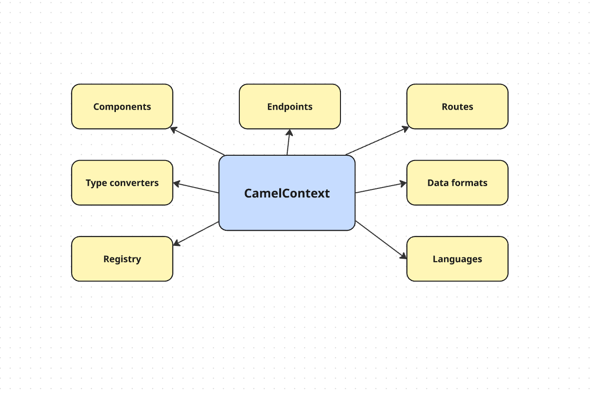
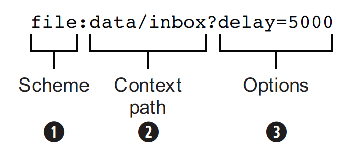

## Architecture



<br>

L'architecture Camel est composée de : 

- **Endpoints** : Un Endpoint est l'interface d'abstraction logicielle, instanciée via une URI, qui fait le pont entre un Composant et une Route pour encapsuler les détails de connexion nécessaires à la création de Producteurs ou de Consommateurs de messages.
  - *Interface d'abstraction* : Elle précise que l'Endpoint masque la complexité technique (on ne gère pas les sockets TCP manuellement, Camel le fait pour nous). 
  - *Instanciée via une URI* : Elle rappelle que c'est la chaîne de caractères (ex: `jms:queue:audit`) qui devient un objet concret en mémoire. 
  - *Lien Composant/Route* : Elle montre la hiérarchie ; le Composant est la "classe", l'Endpoint est "l'instance" configurée.

- **Composants** : Un Component (Composant) agit comme une fabrique d'Endpoints ; c'est une brique fondamentale qui permet de connecter les routes à divers systèmes externes en encapsulant la logique propre à chaque protocole (HTTP, JMS, Fichier, etc.).
  - *La relation "Usine"* : Le Composant est l'objet parent. Son rôle principal est de générer des instances d'Endpoints à la demande. 
  - *L'interaction avec le Context* : On ne manipule pas souvent le Composant directement, mais on peut y accéder via le `CamelContext.getEndpoint()` pour optimiser les performances ou la configuration. 
  - *L'extensibilité* : Camel est modulaire. Si les composants natifs ne suffisent pas, on peut coder son propre "Custom Component".

- **RouteBuilder** : Le RouteBuilder est une classe de base fondamentale utilisée pour définir les règles de routage via un langage dédié (DSL); il agit comme un intégrateur qui assemble les composants (pour la connectivité), les points de terminaison (pour l'adressage) et les processeurs (pour la logique) afin de former des routes exécutables par le CamelContext.

<br>

Nous voyons également dans l'architecture le **CamelContext**, qui agit comme un conteneur englobant les piliers de l'architecture Apache Camel. 
Selon la documentation, il s'agit du système d'exécution (runtime) qui regroupe et coordonne tous les concepts fondamentaux, tels que les routes, les endpoints et les composants.




CamelContext offre l'accès à de nombreuses fonctionnalités et services, les plus notables étant les composants (components), 
les convertisseurs de type (type converters), un registre (a registry), les points de terminaison (endpoints), les routes, les formats de données (data formats) et les langages (languages).


<br>

## Endpoints

Dans l'architecture Apache Camel, un **Endpoint** est l'abstraction qui modélise l'extrémité d'un canal de communication. Considérez-les comme les portes d'entrée et de sortie qui connectent Camel au monde extérieur.

### 1. La structure d'un Endpoint (L'URI)

On configure et on référence toujours un endpoint via une URI. Cette adresse se décompose en trois parties essentielles :




1.  **Le Schéma** : Il désigne le Composant chargé de gérer l'endpoint (ex: `file`, `jms`, `http`).
2.  **Le Chemin contextuel** : Il précise la localisation exacte (ex: un dossier spécifique ou une file d'attente).
3.  **Les Options** : Elles permettent de configurer le comportement (ex: `delay=5000` pour un intervalle de 5 secondes).

### 2. Le rôle de "Fabrique" (Factory)

L'endpoint ne se contente pas d'être une adresse ; c'est une véritable usine logicielle. Selon le besoin de la route, il génère les objets nécessaires au transport des données :

-   **Le Consumer (Consommateur)** : Crée pour recevoir ou "écouter" des messages (la porte d'entrée `from`).
-   **Le Producer (Producteur)** : Crée pour envoyer des messages vers un système externe (la porte de sortie `to`).
-   **L'Exchange** : L'endpoint crée également l'objet Exchange, qui est le conteneur du message circulant dans la route.

### 3. Fonctionnement technique : Du Composant à la Route

Le cycle de vie d'un endpoint suit une hiérarchie stricte :

1.  Le **Composant** agit comme une fabrique d'endpoints.
2.  Le **moteur de routage (Routing Engine)** utilise le langage DSL pour lier ces endpoints entre eux avec des processeurs afin de former une route complète.

**Exemple concret** : `from("file:messages/foo").to("jms:queue:foo");` Ici, Camel utilise un endpoint de type "Fichier" pour lire des données et un endpoint "JMS" pour les envoyer dans une file d'attente.

> L'Endpoint est l'interface universelle de Camel. Peu importe la technologie utilisée (Fichier, HTTP, Email), Camel utilise toujours la même abstraction d'Endpoint, ce qui rend l'intégration de systèmes disparates extrêmement simple et uniforme.


<br>

## Les Routes : Le Cœur d'Apache Camel

Si les Endpoints sont les portes, les Routes sont les couloirs qui dictent le chemin et les transformations que doit subir un message. Une route est une séquence linéaire d'étapes de traitement appliquées à un message entre une source et une destination.

### 1. Qu'est-ce qu'une Route ?

   Une route est l'abstraction centrale qui définit le flux d'intégration. Elle se compose essentiellement d'une chaîne de Processeurs reliés entre eux.

**Caractéristiques clés :**
- **Source unique** : Une route possède une et une seule source d'entrée (input endpoint).
- **Identifiant unique** : Chaque route possède un ID unique permettant de la surveiller, de la déboguer ou de l'arrêter individuellement.
- **Découplage** : Elle sépare les clients des serveurs, permettant un développement indépendant de chaque système.

### 2. Définir une route avec le DSL

   Camel utilise des DSL (Domain Specific Languages) pour écrire les routes de manière déclarative et lisible. Voici les formats les plus courants :

**En Java (Java DSL)**
C'est la méthode la plus populaire. On étend la classe RouteBuilder et on implémente la méthode configure().

```java
// Exemple simple : transfert d'un FTP vers une file ActiveMQ
from("ftp:myserver/folder")
    .routeDescription("Transfert les fichiers FTP vers le système de messagerie")
    .to("activemq:queue:cheese");

// Exemple de chaînage de routes via l'endpoint "direct"
from("file:/path/to/inputDirectory")
    .log("Fichier lu : ${header.CamelFileName}")
    .to("direct:secondRoute");

from("direct:secondRoute")
    .to("file:/path/to/outputDirectory");
```

Note : L'endpoint direct sert ici de connecteur interne entre deux routes.

En XML (XML DSL)
```xml
<route>
<from uri="ftp:myserver/folder"/>
<to uri="activemq:queue:cheese"/>
</route>
```
3. Fonctionnalités avancées
   Les routes ne sont pas de simples "tuyaux", elles offrent une intelligence embarquée :

Préconditions : Vous pouvez décider d'activer ou non une route lors du démarrage selon une condition (ex: si un paramètre est réglé sur 'xml').

EIP (Enterprise Integration Patterns) : Les routes permettent d'intégrer facilement des filtres, des routeurs de contenu ou des agrégateurs.

Documentation intégrée : Depuis Camel 4.16, vous pouvez ajouter des routeDescription (pour le résumé fonctionnel) et des routeNote (commentaires pour les développeurs) qui n'impactent pas l'exécution.

4. Pourquoi utiliser des routes ?
   L'utilisation de routes permet de :

Décider dynamiquement quel serveur invoquer.

Ajouter du traitement supplémentaire (log, enrichissement) de manière flexible.

Tester facilement en remplaçant les vrais systèmes par des "Mocks" (simulations).

La route est l'endroit où vous concevez votre logique d'intégration. Elle commence toujours par un from("endpoint") et utilise le moteur de routage pour câbler les composants et les processeurs ensemble.


### Les Composants : Les piliers de l'extension
Dans l'architecture Apache Camel, les Composants sont les briques fondamentales et le principal point d'extension du framework. Ils agissent comme des adaptateurs ou des ponts qui permettent à Camel de communiquer avec une immense variété de systèmes externes (bases de données, files d'attente, API, fichiers).

1. Le rôle de "Fabrique" (Factory)
   D'un point de vue programmation, le rôle d'un Composant est simple : il sert de fabrique d'instances d'Endpoints.

Chaque composant est associé à un nom utilisé dans une URI.

Par exemple, le FileComponent est identifié par le préfixe file: dans une URI et est responsable de la création des objets FileEndpoint.

2. Configuration à deux niveaux
   L'un des grands avantages des composants est la séparation de la configuration :

Niveau Composant : C'est le niveau le plus haut. Il contient les réglages généraux (identifiants de sécurité, URL de connexion réseau) qui sont hérités par tous les endpoints créés par ce composant.

Niveau Endpoint : Permet de configurer des comportements spécifiques via les paramètres de l'URI (ex: delay=5000).

Astuce technique : Il est recommandé d'utiliser des Property Placeholders (ex: {{my.port}}) pour éviter de coder en dur les informations sensibles ou variables dans vos URIs.

3. Fonctionnement interne et Auto-découverte
   Le CamelContext maintient une cartographie entre les noms (schémas) et les objets Composants. Camel privilégie l'initialisation paresseuse (lazy-initialization) pour charger ces composants :

Lorsqu'une route appelle from("foo:..."), Camel cherche un fichier de propriétés dans META-INF/services/org/apache/camel/component/foo.

Ce fichier indique la classe Java à instancier (ex: class=com.example.FooComponent).

Camel utilise ensuite l'API de réflexion pour créer le composant à la volée.

4. Créer son propre Composant (Custom Component)
   Si les 200+ composants intégrés ne suffisent pas, vous pouvez créer le vôtre :

Étape 1 : Écrire un POJO qui implémente l'interface Component (généralement en héritant de DefaultComponent).

Étape 2 : Créer le fichier de service pour l'auto-découverte dans le dossier META-INF.

Étape 3 : Implémenter la méthode createEndpoint pour gérer vos paramètres spécifiques.

Exemple de gestion de paramètres personnalisés :

```java
protected Endpoint createEndpoint(String uri, String remaining, Map parameters) {
// Camel permet de récupérer et retirer manuellement des paramètres de l'URI
Object value = parameters.remove("size");
// ... logique de configuration ...
}
```

Le Composant est l'usine, l'Endpoint est le produit. En configurant correctement vos composants au niveau du contexte, vous simplifiez énormément l'écriture de vos routes puisque chaque point de terminaison héritera automatiquement des réglages globaux.


<br>

## Les Data Formats : Le traducteur universel de Camel

Dans une architecture d'intégration, les systèmes parlent rarement la même langue. Les Data Formats sont des spécifications qui régissent la représentation et la structure des données lors de leur voyage dans les routes Camel. Ils agissent comme des Message Translators (Traducteurs de messages).

### 1. Marshalling et Unmarshalling

   Le cœur de la transformation de données repose sur deux concepts clés, utilisés par les modèles d'intégration d'entreprise (EIP) :

- **Marshal (Sérialisation)** : Cette opération transforme le corps d'un message (souvent un objet Java) en un format binaire ou textuel prêt à être envoyé sur le réseau.
- **Unmarshal (Désérialisation)** : À l'inverse, cette opération transforme des données reçues du réseau (format binaire ou texte) en un objet Java ou une autre représentation utilisable par l'application.

### 2. Pourquoi les utiliser ?

   Les formats de données définissent comment les informations sont interprétées entre différents systèmes au sein du framework.

- **Exemple concret** : Une application e-commerce reçoit des infos produits en JSON mais doit les envoyer à un système tiers en XML. Camel utilise ses Data Formats pour effectuer cette conversion de manière fluide.
- **Flexibilité** : Camel supporte plus de 40 formats différents, incluant XML, CSV, JSON, YAML, Avro et Protobuf.

### 3. Mise en œuvre dans les routes

   Grâce au Data Format DSL, l'utilisation est très simple dans une route. Voici comment cela se traduit techniquement :

**Exemple en Java DSL :**

```java
from("direct:start")
    .unmarshal().json() // Transforme le JSON reçu en objet Java
    .marshal().jaxb()   // Transforme l'objet Java en XML
    .to("jms:queue:production");
```

**Exemple en XML DSL :**

```xml
<route>
    <from uri="direct:start"/>
    <unmarshal><json/></unmarshal>
    <marshal><jaxb/></marshal>
    <to uri="jms:queue:production"/>
</route>
```

> Les Data Formats sont des composants "emboîtables" (pluggable) qui permettent à Camel de manipuler n'importe quel type de donnée sans changer la logique de routage. C'est ce qui permet à Camel de connecter des systèmes aux technologies totalement disparates.


<br>

## Les Languages : Pour des routes dynamiques et intelligentes

Pour supporter des modèles d'intégration d'entreprise (EIP) flexibles et puissants, Camel propose divers Languages. Ces langages permettent de créer des expressions ou des prédicats (conditions) au sein même des routes et du DSL.

### 1. À quoi servent les Languages ?

   Les langages de script ou d'expression sont utilisés pour définir une logique de traitement dynamique. Ils permettent aux développeurs de :

- **Prendre des décisions** : Évaluer des conditions pour orienter les messages.
- **Manipuler les données** : Extraire ou transformer du contenu pendant le processus de routage.
- **Écrire du code personnalisé** : Insérer une logique spécifique sans quitter le DSL.

### 2. Les types de langages supportés

   Camel supporte environ 20 langages différents, offrant une flexibilité totale selon vos besoins :

- **Langages de script** : Comme Groovy pour une logique complexe.
- **Langages de templating** : Comme Velocity ou Freemarker pour générer du texte.
- **Langages de données** : Pour manipuler le XML ou le JSON (XPath, XQuery, JsonPath).
- **Langages intégrés** : Comme le langage Simple, très utilisé pour les conditions basiques.

### 3. Exemple concret avec le langage "Simple"

   Le langage Simple est souvent utilisé pour filtrer ou orienter les messages selon une condition personnalisée.

**Exemple de routage basé sur le contenu (Content-Based Router) :**

```java
from("direct:start")
    .choice()
        // Utilisation d'un prédicat avec le langage Simple
        .when().simple("${body} contains 'important'")
            .to("mock:importantMessages")
        .otherwise()
            .to("mock:otherMessages");
```

Dans cet exemple, si le corps du message contient le mot "important", il est envoyé vers une destination spécifique, sinon vers une autre.

**Points clés :**
- *Prédicat vs Expression* : Un langage peut servir de prédicat (renvoie vrai ou faux pour un filtre) ou d'expression (renvoie une valeur, comme le nom d'un fichier).
- *Annotations* : La plupart de ces langages peuvent aussi être utilisés via des annotations directement dans vos Java Beans.
- *Combinaison* : Vous avez la flexibilité totale pour utiliser différents langages au sein d'une même route selon la complexité de la tâche.

<br>

## Les Type Converters : La fluidité des données

Dans Apache Camel, les Type Converters sont des composants essentiels qui convertissent automatiquement le contenu du message (payload) d'un type à un autre. Ils permettent une intégration fluide entre des systèmes hétérogènes qui utilisent des formats différents (fichiers, chaînes de caractères, flux, etc.).

### 1. Pourquoi utiliser des convertisseurs ?

   Le routage de messages implique souvent des changements de formats. Camel gère nativement les conversions entre les types les plus courants :

- **Fichiers & Flux** : `File`, `InputStream`, `OutputStream`.
- **Textes & Octets** : `String`, `byte[]`, `ByteBuffer`.
- **XML** : `Document` et `Source`.

**La force de Camel** : Vous ne précisez que le type de résultat souhaité. Camel déduit le type d'entrée et choisit la méthode de conversion appropriée.

### 2. Comment fonctionne la conversion ?

   Le mécanisme repose sur l'interface TypeConverter et son registre (TypeConverterRegistry).

- **Le Registre** : Camel maintient une cartographie de toutes les combinaisons de conversions possibles.
- **L'API** : La méthode principale est `<T> T convertTo(Class<T> type, Exchange exchange, Object value)`.
- **Statistiques** : Depuis Camel 4.7.0, vous pouvez activer la collecte de statistiques d'utilisation du registre pour surveiller les performances via JMX ou Java.

```java
// Activation des statistiques en Java
context.setTypeConverterStatisticsEnabled(true);
```

### 3. Créer ses propres convertisseurs avec @Converter

   Tous les convertisseurs officiels sont des méthodes Java annotées. Vous pouvez créer les vôtres en suivant ce modèle :

```java
@Converter(generateLoader = true) // Génération automatique pour un chargement rapide
public class MonConvertisseur {
    @Converter
    public static InputStream toInputStream(File file) throws FileNotFoundException {
        return new BufferedInputStream(new FileInputStream(file));
    }
}
```

**Optimisation des performances**

Camel propose trois niveaux de découverte pour charger les convertisseurs :

1. **Standard** : Découverte automatique des JARs via `META-INF`.
2. **Fast (Rapide)** : Utilisation de `generateLoader = true` pour éviter l'utilisation de la réflexion Java.
3. **Fastest (Le plus rapide)** : Utilisation de `generateBulkLoader = true` (depuis Camel 3.7) pour regrouper tous les convertisseurs d'un module dans une seule classe utilisant des primitives Java.

### 4. Cas particuliers : Fallback et Null

- **Fallback Converters** : Utilisés en dernier recours quand les convertisseurs classiques échouent. Ils ont une portée plus large pour gérer des hiérarchies de classes complexes.
- **Gestion du Null** : Par défaut, un convertisseur ne doit pas renvoyer `null`. Si c'est nécessaire, il faut l'autoriser explicitement avec `@Converter(allowNull = true)`.

### 5. Exemple dans une Route

   Dans vos routes, la conversion est souvent implicite ou appelée via convertBodyTo.

```java
from("direct:start")
    .convertBodyTo(MyJavaObject.class) // Conversion automatique (ex: XML vers POJO)
    .to("mock:result");
```

> **L'essentiel à retenir** : Le système de Type Conversion d'Apache Camel est une "boîte noire" intelligente. En utilisant les annotations `@Converter` et en activant les chargeurs automatiques (Loaders), vous permettez à vos routes de manipuler des données complexes sans jamais vous soucier de la logique de transformation technique sous-jacente.

### Différence : Implicite vs Explicite

| Caractéristique | Type Converters | Data Formats |
| :--- | :--- | :--- |
| **Objectif** | Conversion de types d'objets Java (technique). | Traduction de formats de messages (métier). |
| **Utilisation** | Souvent automatique (via le TypeConverterRegistry). | Toujours déclarative via marshal / unmarshal. |
| **Mécanisme** | Basé sur l'interface TypeConverter et les annotations @Converter. | Basé sur l'interface DataFormat (EIP Message Translator). |
| **Exemples** | String ↔ byte[], File ↔ InputStream. | JSON ↔ Java Object, XML ↔ CSV. |

<br>

## Le Registry : L'annuaire central de Camel

Dans l'architecture Apache Camel, le Registry est un mécanisme de stockage et de récupération d'objets ou de composants utilisés dans les routes. Il agit comme un répertoire central pour gérer et rechercher diverses ressources, telles que des beans, des points de terminaison ou des composants personnalisés.

### 1. Une interface commune pour tous les environnements

   L'API org.apache.camel.spi.Registry est conçue pour fonctionner de manière uniforme, quel que soit l'environnement d'exécution (Spring Boot, Quarkus, Kafka, ou Standalone).

Camel utilise par défaut le DefaultRegistry qui suit une logique de recherche précise :

1. Il cherche d'abord les beans dans la plateforme d'exécution native (ex: le conteneur Spring ou Quarkus).
2. En cas d'échec, il bascule sur le SimpleRegistry propre à Camel.

### 2. Les deux types d'APIs : Binding et Lookup

   Le fonctionnement du Registre repose sur deux actions principales : l'enregistrement et la recherche.

**A. API de Binding (Enregistrement)**

Elle permet d'ajouter de nouveaux beans au Registre. Si un bean implémente CamelContextAware, le Registre lui injectera automatiquement le contexte Camel.

*Exemple technique en Java :*

```java
// Enregistrement manuel d'un bean
Object myFoo = new MyFoo();
camelContext.getRegistry().bind("foo", myFoo);

// Utilisation immédiate dans une route
from("jms:cheese").bean("foo");
```

Dans les environnements modernes, l'enregistrement se fait souvent via des annotations natives :

 - **Spring Boot** : Utilisation de `@Bean`.
 - **Quarkus** : Utilisation de `@Produces` et `@Named("foo")`.

**B. API de Lookup (Recherche)**

C'est la partie la plus sollicitée, notamment lors du démarrage pour "câbler" (wire) les composants et processeurs entre eux.

 - `lookupByName(String name)` : Retourne l'objet ou null.
 - `lookupByNameAndType(String name, Class<T> type)` : Évite le transtypage (casting) manuel.
 - `findByType(Class<T> type)` : Trouve tous les beans d'un certain type.

### 3. Injection de Dépendances

Au lieu de chercher manuellement dans le registre, vous pouvez utiliser l'injection :

- **Camel Standalone** : Utilisation de `@BeanInject`.
- **Spring Boot / Quarkus** : Il est fortement recommandé d'utiliser les annotations natives comme `@Autowired` ou `@Inject`.

> **Ce qu'il faut retenir** : Le Registry est le "colle" qui lie votre code personnalisé (Beans) au moteur de routage de Camel. Il permet de garder vos routes propres en référençant des objets par leur ID (`.bean("monId")`) plutôt que d'instancier de la logique complexe directement dans le DSL.

<br>

## Moteur de routage

Un réseau DSL relie les endpoints et les processeurs (processors) pour établir des routes.