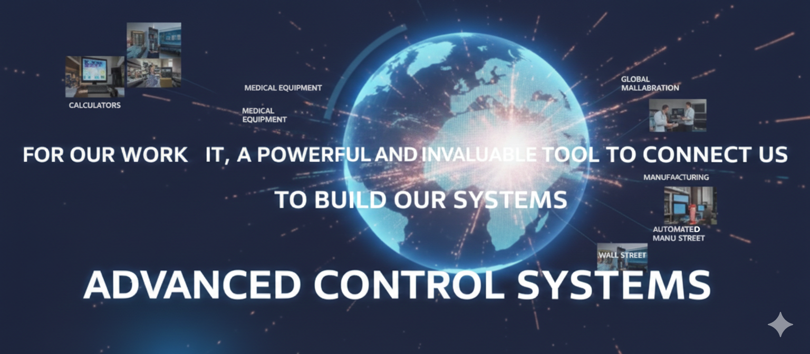

## What is Information Technology?

 

Information technology has completely transformed our lives in ways you may not even realize. Thanks to IT, we can communicate massive amounts of information to people and organizations across the world in the blink of an eye. Computers power everything, from calculators to medical equipment, from complex satellite systems to the Wall Street trading floor. These are powerful and invaluable tools that help people do their jobs and allow us to connect with one another.

 
So what exactly is Information Technology? IT is essentially the use of technology, like computers and the internet, to store and process data into useful information. The IT industry refers to the entire spectrum of jobs and resources related to computing technologies within society.

And there are many different types of jobs in this sector, from **network engineers** who ensure computers can communicate with each other, to **hardware technicians** who replace and repair components, to **help desk support** ensuring end-users can use their software correctly. But IT isn't just about building computers and using the internet; it's mostly about people. That is the heart of IT.

What good are technology or information if people cannot use the technology or make sense of the information? Information technology helps people solve important problems using technology, which is why you will see its influence in **education, medicine, journalism, construction, transportation, entertainment, or really any industry on the planet**.

IT changes the world in how we collaborate, share, and create together. IT has become such a vital tool in modern society that people and businesses without access to IT are disadvantaged.

**IT skills have become necessary for everyday life, finding a job, getting an education, and checking your health records**. You may come from a community where there was no Internet, or you couldn't afford a super-fast computer and had to use the one at school or the library. There are many economic reasons why some people have IT knowledge and others do not. This growing gap in knowledge is called **the digital divide**.

People without digital literacy are left behind. But people like us are the real solution to bridging this digital divide. Overcoming the digital divide involves not only confronting and understanding the combination of socio-economic factors that shape our experience, but also helping others confront and understand these experiences. By entering the world of IT, we help those in our communities or businesses and perhaps inspire a new generation of IT pioneers.

When I think about the divide problem, I can't help but think of all the opportunities and progress that people from different backgrounds and perspectives in the industry can bring.

### What does an IT Support Specialist do?

# So what is the daily work of a support technician?

It varies enormously, depending on whether you provide support on-site or remotely, in a small or large company, and there isn't really a daily routine because the difficulties and challenges are constantly renewing and are always interesting. But generally speaking, **a support technician ensures that a company's technological equipment works correctly**. This includes management, installation, maintenance, diagnosis, and configuration of computer and electronic equipment.

I love solving problems, and I love constantly stepping out of my comfort zone to learn and grow. There have never been as many opportunities to enter IT as there are now. Not only is the IT field incredibly diverse, but job prospects are also exploding. Job growth of 14% in IT is projected in the US alone over the next 10 years. That's higher than the average for all other occupations.

What does this mean? There are thousands of companies around the world looking for IT professionals like us. In short, the IT field is incredible and full of opportunities, and I am thrilled to be in this field.
